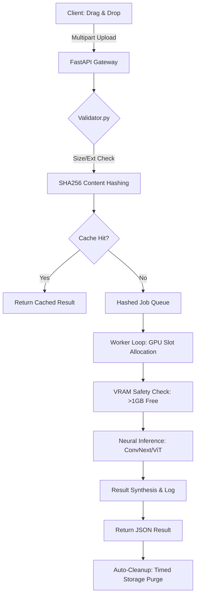

# 🚀 DF-ENGINE v3.1: Neural Inference Cluster

**DF-Engine** is a production-grade, research-backed AI system designed for high-throughput media integrity analysis. Utilizing an ensemble of modernized CNN and Vision Transformer (ViT) architectures, the cluster identifies synthetic media artifacts with an **F1 Score of 0.9820**.

[](https://fastapi.tiangolo.com/)
[](https://reactjs.org/)
[](https://tailwindcss.com/)
[](https://pytorch.org/)

---

## 🧠 System Architecture

The engine is built on a **Synchronous Asynchronous Hybrid Pipeline**. While the frontend experiences a streamlined "upload-and-wait" flow, the backend manages a complex state machine to optimize GPU utilization and prevent resource exhaustion.

### 🔄 Request Lifecycle


---

## 🛠️ Key Technical Features

### 1. Advanced Vision Ensemble
The system cross-validates integrity across three distinct architectures to minimize false positives:
*   **ConvNeXt-Base**: Modernized CNN backbone for high-fidelity spatial feature extraction.
*   **ViT-B/16 (Vision Transformer)**: Leverages global self-attention to detect long-range temporal inconsistencies.
*   **ResNet-50**: Provides a stable residual-link baseline for gradient validation.

### 2. High-Throughput Backend (FastAPI)
*   **Hashed Job Queue**: Implements SHA256 content hashing to avoid redundant processing of duplicate media.
*   **VRAM-Aware Scheduling**: Dynamically monitors GPU memory (`torch.cuda.mem_get_info()`) before job execution to prevent OOM (Out of Memory) failures.
*   **Distributed Resource Lifecycle**: Features a 5-minute GPU offloading policy for idle models and a 10-minute automated storage purge for ephemeral research data.

### 3. Production-Grade Frontend (React v19)
*   **Motion UI**: Fluid state transitions using `Framer Motion` and high-end cinematic design with `Tailwind CSS v4`.
*   **Centralized Telemetry**: A custom `useSystemStatus` hook that synchronizes cluster health (GPU temperature, VRAM, node status) across the entire application.
*   **Data Visualization**: Real-time training progress and Celeb-DF evaluation curves rendered via `Recharts`.

### 4. Billing & Secure Ingress
*   **Google OAuth2**: Fully authenticated research node initialization.
*   **Tiered Credits**: Categorized balance tracking for **Image Verification** and **Video Intelligence**.
*   **Razorpay Integration**: Category-aware payment processing for credit provisioning.

---

## 📊 Technical Benchmarks

| Architecture | Best Val F1 | Celeb-DF ROC-AUC | Inference Latency |
| :--- | :--- | :--- | :--- |
| **ConvNeXt-Base** | **0.9820** | 0.6498 | < 124ms / sample |
| **ViT-B/16** | 0.8536 | 0.4565 | < 180ms / sample |
| **ResNet-50** | 0.4749 | --- | < 90ms / sample |

---

## 🚀 Deployment & Installation

### Backend Setup
1. Define environment variables in `.env` (JWT_SECRET, Razorpay Keys, etc.).
2. Run via Uvicorn:
```bash
uvicorn main:app --host 0.0.0.0 --port 82
```

### Frontend Setup
1. Configure Nginx reverse proxy for `/deepfake/api` routing.
2. Build and serve:
```bash
npm install
npm run build
```

---

## 👨‍💻 Developer's Message
Developed as a production-grade showcase of distributed AI inference and modernized full-stack engineering.
